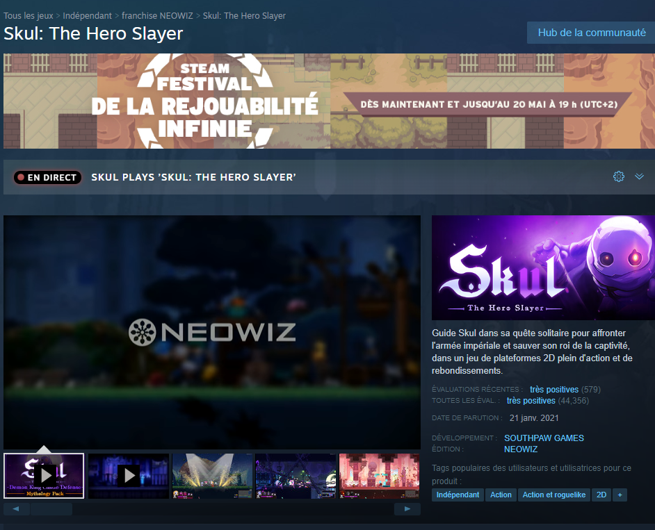
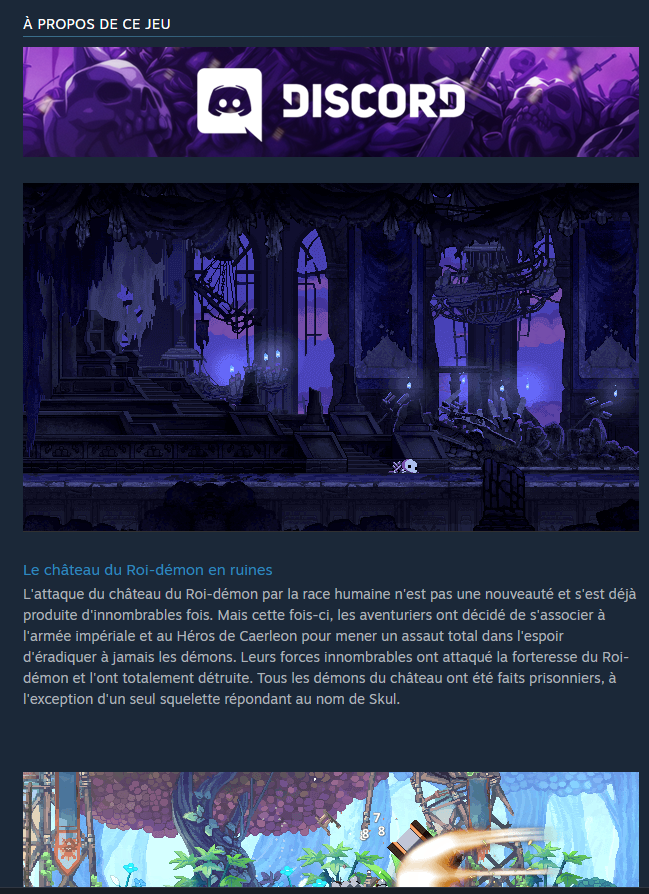
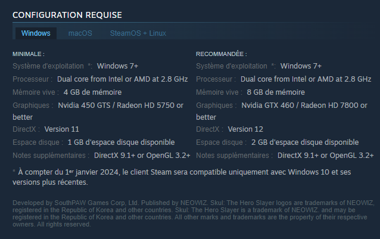

# Une belle présentation de projet 
Je te propose de prendre pour exemple ce projet de Mickael : 
https://github.com/RyuuCreator/KNT_Sync

Il a réalisé la présentation sous mes conseils et je trouve qu'il a très bien mis en pratique ! 

# Recette : 
- Un titre avec une seule petite ligne de présentation
- Une description plus détaillée
- Une procédure d'installation & prérequis
- Une galerie photo

# Plus en détail :
Dans un projet il faut toujours une description, une parti installation et, si c'est un projet qui a vocation à appuyer tes candidatures, une galerie ! (c'est ultra important!)

Alors non, ce n'est pas necessaire de faire ça sur tous les projets mais idéalement, il faudrait en faire entre 1 et 4 pour les afficher en page d'accueil de ton github.
Si tu regarde le github de RyuuCreator, les 4 projets sont bien présentés :

Il faut s'imaginer qu'il sera assez rare que des recruteurs/développeurs viennent jusqu'à ton github, et qu'il sera extrèmement rare que ceux ci (voir 0%) installent les projets.
En général ils s'arrète à la présentation
Alors il faut vraiment mettre le paquet sur celle ci!
Il faut qu'elle soit ni trop grande, ni trop courte et qu'elle offre les détails les plus importants avec un rendu visuel.
Il faut s'imaginer soit même cela comme une sorte de politesse : Tu fais un effort toi même pour éviter tout effort au visiteur.
Il faut que le visiteur puisse se dire qu'il n'a même pas besoin d'installer le projet pour comprendre ce qu'il y a dedans.
Je te donne un autre exemple..
Ce n'est pas une projet Github mais un jeu vidéo dans une boutique en ligne !
Et bien, c'est pareil ! 
Pour vendre leur produit ils affichent une gallerie (Video ou photo), une partie technique avec la configuration requise etc.. et enfin une description détaillée 🙂

Les choses à vendre ici, ce sont tes compétences, ta valeur !