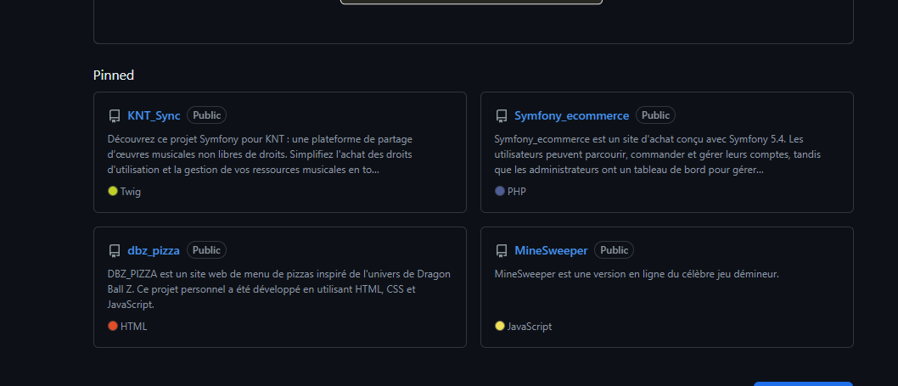

# Une belle présentation de projet 
Je te propose de prendre pour exemple ce projet de Mickael : 
https://github.com/RyuuCreator/KNT_Sync

Il a réalisé la présentation sous mes conseils et je trouve qu'il a très bien mis en pratique !

# Recette :
- Un titre avec une seule petite ligne de présentation
- Une description plus détaillée
- Une procédure d'installation & prérequis
- Une galerie photo

# Plus en détail :
Dans un projet, il faut toujours une description, une partie installation et, si c'est un projet qui a vocation à appuyer tes candidatures, une galerie ! (c'est ultra important !)

Alors non, ce n'est pas nécessaire de faire ça sur tous les projets mais idéalement, il faudrait en faire entre 1 et 4 pour les afficher en page d'accueil de ton GitHub. Si tu regardes le GitHub de RyuuCreator, les 4 projets sont bien présentés :

  

Il faut s'imaginer qu'il sera assez rare que des recruteurs/développeurs viennent jusqu'à ton GitHub, et qu'il sera extrêmement rare que ceux-ci (voire 0 %) installent les projets. En général, ils s'arrêtent à la présentation. Alors il faut vraiment mettre le paquet sur celle-ci ! Il faut qu'elle soit ni trop grande, ni trop courte et qu'elle offre les détails les plus importants avec un rendu visuel. Il faut s'imaginer cela comme une sorte de politesse : tu fais un effort toi-même pour éviter tout effort au visiteur. Il faut que le visiteur puisse se dire qu'il n'a même pas besoin d'installer le projet pour comprendre ce qu'il y a dedans. Je te donne un autre exemple... Ce n'est pas un projet GitHub mais un jeu vidéo dans une boutique en ligne ! Eh bien, c'est pareil ! Pour vendre leur produit, ils affichent une galerie (vidéo ou photo), une partie technique avec la configuration requise, etc., et enfin une description détaillée 🙂

  
  
  

## Les choses à vendre ici, ce sont tes compétences, ta valeur !
